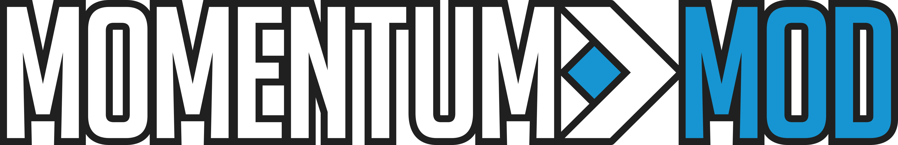

> *Momentum Mod is a standalone game built on the Source Engine, aiming to centralize movement gametypes found in CS:S, CS:GO, and TF2.*

The frontend of the site runs Angular 8 and utilizes the ngx-admin/nebular frameworks. It and its instructions can be found in the [client/](client/) folder.

The backend of the website runs NodeJS and Sequelize (MySQL). The backend, and instructions to run it can be found in the [server/](server/) folder.

## *Something wrong with the site?*  
[Submit an issue](https://github.com/momentum-mod/website/issues/new) with some pictures and/or web console error output!

## *Want to help out?*
[Join our Discord](https://discord.gg/wQWkRb6) and let us know! We also accept pull requests, *but make sure the issue/feature isn't already assigned to someone!*